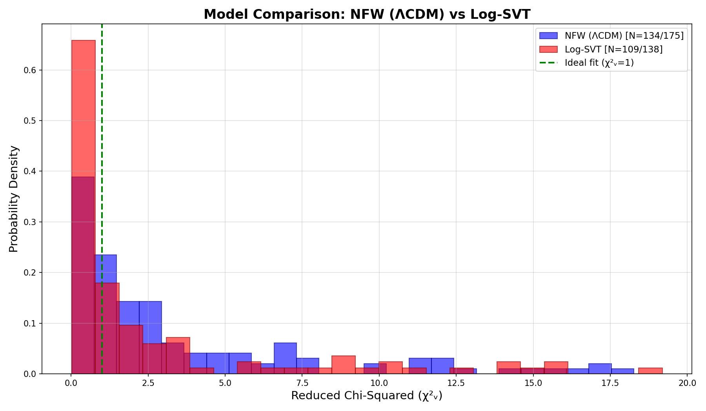
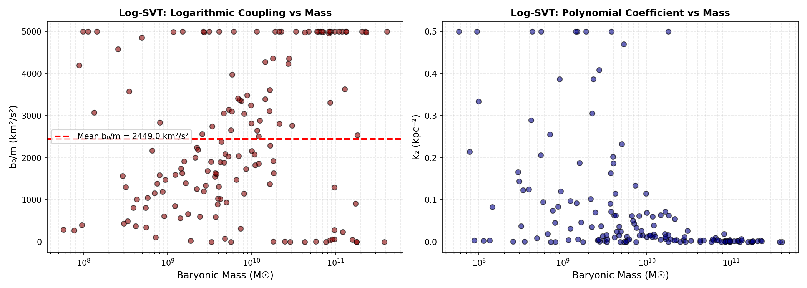

# Superfluid Vacuum Theory: Galaxy Rotation Curves

[](https://opensource.org/licenses/MIT)
[](https://www.python.org/downloads/)
[](https://doi.org/10.5281/zenodo.18150850)

**A unified framework explaining galaxy rotation curves and supermassive black holes as emergent phenomena from quantum vacuum dynamics — without dark matter particles.**

---

## 📄 Paper

This repository accompanies the research paper:

> **Galaxy Rotation Curves from Superfluid Vacuum Theory: A Unified Framework Integrating the Vortex–Black Hole Correspondence**  
> Shah, C. (2026)  
> 🔗 **DOI:** [10.5281/zenodo.18150850](https://doi.org/10.5281/zenodo.18150850)

---

## 🌌 Overview

This repository implements a theoretical framework that provides a **dark matter-free explanation** for galaxy rotation curves based on **Superfluid Vacuum Theory (SVT)**. The framework makes a radical proposal:

> **Supermassive black holes are macroscopic topological defects (vortex cores) in the quantum vacuum, and what we call "dark matter halos" are the gravitating rotational energy of extended vortex fields anchored by these central defects.**

In other words: *the central black hole and the dark matter halo are two aspects of a single topological structure*.

---

## 🔬 The Physics

### Core Idea

The physical vacuum is modeled as a **Bose-Einstein condensate** governed by the **logarithmic nonlinear Schrödinger equation (Log-NLSE)**:

$$i\hbar \frac{\partial \psi}{\partial t} = -\frac{\hbar^2}{2m}\nabla^2\psi + m\Phi\psi - b\ln\left(\frac{|\psi|^2}{\rho_0}\right)\psi$$

This equation has a crucial property: the **speed of sound is density-independent** ($c_s = \sqrt{b/m}$), providing a natural explanation for the constancy of the speed of light.

### The SVT Velocity Formula

The vacuum contribution to galaxy rotation curves is:

$$V_{\text{SVT}}(r) = V_\infty \cdot \sqrt{\ln\left(1 + \frac{r}{r_c}\right)} \cdot \left[\ln\left(1 + \frac{M_b}{M_c}\right)\right]^{1/4}$$

Where:
- $V_\infty$ = asymptotic velocity scale (related to vacuum sound speed)
- $r_c$ = core radius (effective healing length at galactic scales)
- $M_b$ = total baryonic mass
- $M_c \sim 10^6 M_\odot$ = critical mass scale

### Vortex–Black Hole Correspondence

| Superfluid Vortex | Black Hole |
|-------------------|------------|
| Vortex core (ρ = 0) | Singularity |
| Ergosphere (v = cₛ) | Event horizon |
| Winding number n | Angular momentum J = nℏ |
| Vortex energy E | Mass M = E/c² |
| Healing length ξ | Planck length ℓₚₗ |

---

## 📊 Key Results

### SPARC Database Validation

Tested against **175 galaxies** from the SPARC (Spitzer Photometry and Accurate Rotation Curves) database:

| Metric | SVT | NFW (ΛCDM) |
|--------|-----|------------|
| **Median χ²ᵥ** | 2.53 | 2.37 |
| **Mean χ²ᵥ** | 10.48 | 10.90 |
| **Excellent fits (χ²ᵥ < 1)** | 25.7% | 30.4% |
| **Good fits (χ²ᵥ < 2)** | 42.7% | 46.8% |
| **Head-to-head wins** | 50.9% | 49.1% |

**Conclusion:** SVT achieves statistical parity with the standard dark matter model while requiring **no invisible particles**.

### Visual Results





---

## ✨ What This Framework Explains Naturally

| Observation | ΛCDM Explanation | SVT Explanation |
|-------------|------------------|-----------------|
| **Flat rotation curves** | Dark matter particles | Vacuum vortex energy |
| **Baryonic Tully-Fisher Relation** (V⁴ ∝ M) | Fine-tuned feedback | Built into mass factor |
| **M–σ relation** | Co-evolution | Topological unity |
| **Ubiquity of SMBHs** | Evolutionary coincidence | Topological necessity |
| **Core-cusp problem** | Requires baryonic feedback | Naturally cored profiles |
| **Radial Acceleration Relation** | Coincidental | Fundamental |

---

## 📁 Repository Structure

```
SVT-Galaxy-Rotation-Curves/
├── README.md                        # This file
├── model_fitter.py                  # Main fitting code for SVT and NFW models
├── galaxy_chi2_comparison.csv       # Chi-squared results for all 175 galaxies
├── final_showdown.png               # SVT vs NFW comparison visualization
├── svt_parameter_universality.png   # Parameter distribution analysis
├── galaxy_fits/                     # Individual galaxy rotation curve fits
│   └── [galaxy_name].png            # Fit plots for each SPARC galaxy
└── sparc_data/
    └── sparc_database/              # SPARC galaxy database files
        └── [galaxy_name].txt        # Rotation curve data for each galaxy
```

---

## 🚀 Installation

```bash
git clone https://github.com/wohlig/SVT-Galaxy-Rotation-Curves.git
cd SVT-Galaxy-Rotation-Curves
pip install numpy scipy matplotlib pandas
```

### Dependencies

- Python 3.8+
- NumPy
- SciPy
- Matplotlib
- Pandas

---

## 💻 Usage

### Running the Model Fitter

```bash
python model_fitter.py
```

This will:
1. Load all SPARC galaxy data
2. Fit both SVT and NFW models to each galaxy
3. Generate comparison plots in `galaxy_fits/`
4. Output statistics to `galaxy_chi2_comparison.csv`

### Basic SVT Rotation Curve Calculation

```python
import numpy as np

def V_svt(r, V_infty, r_c, M_bary):
    """
    SVT rotation curve from Logarithmic Superfluid Vacuum.
    
    Parameters:
        r       : Radius array (kpc)
        V_infty : Asymptotic velocity scale (km/s)
        r_c     : Core radius (kpc)
        M_bary  : Baryonic mass (solar masses)
    
    Returns:
        Vacuum contribution to rotation velocity (km/s)
    """
    M_crit = 1.0e6   # Critical mass (solar masses)
    R_norm = 50.0    # Normalization radius (kpc)
    
    # Spatial profile (logarithmic)
    spatial = np.sqrt(np.log(1 + r / r_c))
    norm = np.sqrt(np.log(1 + R_norm / r_c))
    
    # Mass factor (BTFR scaling)
    mass_factor = np.log(1 + M_bary / M_crit)**0.25
    
    return V_infty * (spatial / norm) * mass_factor


# Example: Calculate rotation curve
r = np.linspace(0.1, 30, 100)  # radius in kpc
V_infty = 150                   # km/s
r_c = 3.0                       # kpc
M_bary = 1e10                   # solar masses

v_svt = V_svt(r, V_infty, r_c, M_bary)
```

### Total Rotation Velocity

```python
def V_total(r, V_gas, V_disk, V_bulge, V_infty, r_c, M_bary):
    """
    Total rotation velocity combining baryonic and SVT components.
    """
    V_bary = np.sqrt(V_gas**2 + V_disk**2 + V_bulge**2)
    V_halo = V_svt(r, V_infty, r_c, M_bary)
    return np.sqrt(V_bary**2 + V_halo**2)
```

---

## 🔮 Predictions

The SVT framework makes testable predictions:

1. **No direct detection:** Dark matter particle searches will continue to yield null results
2. **Tighter M–σ relation:** Black hole mass and halo properties should correlate more tightly than ΛCDM predicts
3. **No orphan halos:** Dark matter halos without associated galaxies and central black holes should not exist
4. **Universal vacuum parameters:** V∞ and rᶜ should show systematic trends across galaxy types

---

## 📚 Related Papers

1. **Vortex–Black Hole Correspondence:** [DOI: 10.5281/zenodo.18144224](https://doi.org/10.5281/zenodo.18144224)
2. **Primordial SMBHs as Topological Defects:** *(in preparation)*

---

## 📖 Citation

If you use this code or find our work useful, please cite:

```bibtex
@article{shah2026svt_unified,
  title={Galaxy Rotation Curves from Superfluid Vacuum Theory: A Unified Framework Integrating the Vortex–Black Hole Correspondence},
  author={Shah, Chintan},
  year={2026},
  doi={10.5281/zenodo.18150850},
  url={https://doi.org/10.5281/zenodo.18150850}
}

@article{shah2026vortex_bh,
  title={Quantum Vortices as Black Hole Analogs in Logarithmic Superfluid Vacuum Theory},
  author={Shah, Chintan},
  year={2026},
  doi={10.5281/zenodo.18144224},
  url={https://doi.org/10.5281/zenodo.18144224}
}
```

---

## 🔗 References

- **SPARC Database:** [Lelli, McGaugh & Schombert (2016)](https://astroweb.case.edu/SPARC/)
- **Logarithmic Quantum Mechanics:** Białynicki-Birula & Mycielski (1976)
- **Superfluid Vacuum Theory:** Volovik (2003), Zloshchastiev (2011, 2018, 2023)
- **Analog Gravity:** Unruh (1981), Barceló, Liberati & Visser (2005)

---

## 📜 License

This project is licensed under the MIT License - see the [LICENSE](LICENSE) file for details.

---

## 👤 Author

**Chintan Shah**  
Independent Researcher, Mumbai, India  
📧 chintan@wohlig.com  
🐙 GitHub: [@wohlig](https://github.com/wohlig)

---

## 🙏 Acknowledgments

- The SPARC team for making their galaxy database publicly available
- K. G. Zloshchastiev for foundational work on logarithmic superfluid vacuum theory
- G. E. Volovik for pioneering the superfluid vacuum framework

---

<p align="center">
  <i>"The missing mass is not missing particles — it is the gravitating energy of the vacuum's topological configuration."</i>
</p>
